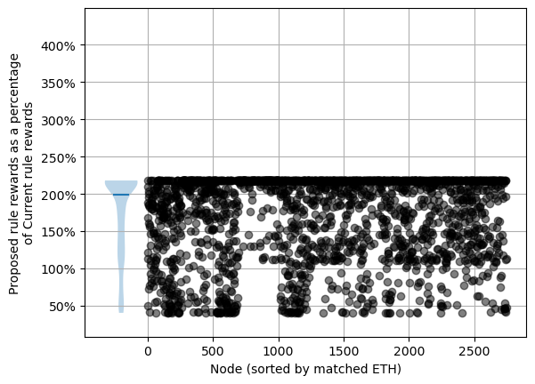

## Summary
### Goals
- Concentrate spend on RP goals, particularly incentivizing NOs to create rETH supply by making
  minipools and rewarding LEB8s more than EB16s
- Avoid spend that doesn't support RP goals, particularly unneccessarily rewarding speculation
- Folks shouldn't feel trapped - some exit friction is ok... predictable is good, and we shouldn't
  be extortionate
- Folks shouldn't feel they have to actively modify allocations for every little ratio change

### Proposed changes
- Rewards will be based on weight
  - If you're below 10% borrowed ETH, weight is 0
  - From 10%-15% borrowed ETH, weight is linear with the amount of borrowed ETH
    - 🧮 `weight = 100 * staked_rpl_value_in_eth`
  - Above 15%, weight follows a logarithmic curve, rising forever, but ever-more-slowly
    - 🧮 `weight = (13.6137 + 2 * ln(100 * (staked_rpl_value_in_eth / borrowed_eth) - 13)) * borrowed_eth`
  - The NO share of inflation gets split up as `weight/total_summed_weight`
- The minimum to withdraw will be 15% borrowed ETH
- Make withdrawal a 2-step process
  - Set X RPL to "withdrawing"; these RPL are no longer eligible for rewards or voting
  - After a time period (make a setting; start it at 28 days), the RPL may be withdrawn
  - (Remove the current withdrawal lock when you stake RPL)
- Phase in the new rules slowly over 6 months (see [below](#phasing-in-the-rules))
- These changes apply equally to both existing and new NOs

## Context
### How RP currently spends inflation revenue
|  |      |
|:--------------------------------------:|:-----------------------------------:|

As we can see - our spend on NOs is enormous -- it's _really important_ that we make it count. \
A year of inflation is about 981k RPL, with 687k going to NOs. At the current price of $28, that's
$19.2M per year going to NOs.

### How RP currently spends NO rewards
### TODO
pie chart showing how much we spend on (pETH) 10-15%, etc for each 5%

pie chart showing how much we spend on pETH 10-15%, 15-30%, >30% [incentivizing minipools, plausible overshoot, speculation]

### Proposed NO reward spend
### TODO
pie chart showing how much we'd spend on (pETH) 10-15%, etc for each 5%

pie chart showing how much we'd spend on pETH 10-15%, 15-30%, >30% [incentivizing minipools, plausible overshoot, speculation]

### Current vs proposed
### TODO
Categorized pie chart comparison

Make pie chart showing _total_ spend (oDAO, dev, etc) with the NO categories

## Details
### Phasing in the rules
For rewards, this can be achieved by calculating the "share of the pie" for both rule sets, and then
adding them together in a changing proportion.
- Period X after the vote: `0.17*x*proposed_share + 0.17*(6-x)*current_share`  
- After period 5, simply used proposed_share

For the withdrawal threshold, it's a little complicated. First, it requires a pDAO guardian action,
so we don't want to do a ton of changes. Second, the current setting is based off of bonded ETH,
_not_ borrowed ETH. This means 16-ETH minipool holders will have a higher withdrawal threshold than
intended. Still, it will be much lower than the current one (less than a third).
- After Period X=3 rewards go out, set withdrawal threshold to 100% bonded ETH
- After Period X=6 rewards go out, set withdrawal threshold to 45% bonded ETH
  - This is equivalent to the desired 15% borrowed ETH for LEB8s; unfortunately, it's 45% borrowed
    ETH for 16-ETH minipools, but that's the best we can do without a SC change
- In the next planned Smart Contract release, update to be based on borrowed ETH
  - Once active, set withdrawal threshold to 15% borrowed ETH

### What does this mean for me?
In the long run, people might change allocations, so it's not an easy answer, but we can look at
what it means _immediately_. 
- There's a simulator at https://www.desmos.com/calculator/f94bvquuxd
  - You enter the number of 8/16 ETH minipools, and the amount of staked RPL
  - You read off your share of the pie (in millionths) on line 10 for the current structure and
    line 12 for the proposed structure
- Currently, the only folks that would go down in rewards are folks with EB16s and very high staked
  RPL. This makes sense given the goal of incentivizing rETH supply.
- The folks that win the most are those at the low end of staked RPL staked on LEB8s. This makes
  sense because these folks are a little hesitant; we're using greater rewards to convince them to
  join and/or make more minipools.
- Note: since the calculations are based on the amount of borrowed ETH and staked RPL, there's no
  way to use splitting across multiple nodes to get more rewards

### TODO: should I even include this, or just nuke it?
The plots below on the left shows the impact on rewards for a single minipool based on amount of
staked RPL. The plot on the right shows every NO and how their rewards will change under the new
system.

|  |  |
|:--------------------------------:|:-----------------------------------:|
