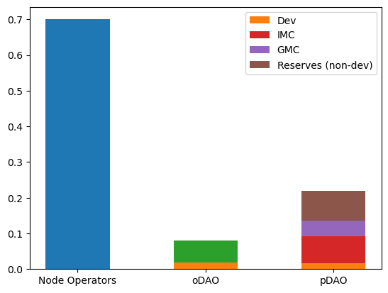
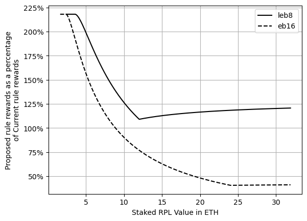

## Summary
### Goals
- Concentrate spend on RP goals, particularly incentivizing NOs to create rETH supply by making
  minipools and rewarding LEB8s more than EB16s
- Avoid spend that doesn't support RP goals, particularly unneccessarily rewarding speculation
- Folks shouldn't feel trapped - some exit friction is ok... predictable is good, and we shouldn't
  be extortionate
- Folks shouldn't feel they have to actively modify allocations for every little ratio change

### Proposed changes
- Rewards will scale differently (see [details below](#the-actual-reward-math))
  - Adding a minipool will increase RPL rewards (even if you already had enough staked RPL)
    **[new]**
  - Converting an EB16 to an LEB8 will increase rewards (even if you already had enough staked RPL)
    **[new]**
  - You need at least 10% borrowed ETH to get rewards **[unchanged]**
  - Staking more RPL means more rewards **[unchanged]**, now without a maximum **[new]**
  - Beyond 15% borrowed ETH, additional rewards go up slower and slower **[new]**
- The minimum to withdraw will be 15% borrowed ETH
- Make withdrawal a 2-step process
  - Set X RPL to "withdrawing"; these RPL are no longer eligible for rewards or voting
  - After a time period (make a setting; start it at 28 days), the RPL may be withdrawn
  - (Remove the current withdrawal lock when you stake RPL)
- Phase in the new rules slowly over 6 months (see [details below](#phasing-in-the-rules))
- These changes apply equally to both existing and new NOs

## Context
### How RP currently spends inflation revenue
|  |      |
|:--------------------------------------:|:-----------------------------------:|

As we can see - our spend on NOs is enormous -- it's _really important_ that we make it count. \
A year of inflation is about 981k RPL, with 687k going to NOs. At the current price of $28, that's
$19.2M per year going to NOs.

### How RP currently spends NO rewards
### TODO
pie chart showing how much we spend on (pETH) 10-15%, etc for each 5%

pie chart showing how much we spend on pETH 10-15%, 15-30%, >30% [incentivizing minipools, plausible overshoot, speculation]

### Proposed NO reward spend
### TODO
pie chart showing how much we'd spend on (pETH) 10-15%, etc for each 5%

pie chart showing how much we'd spend on pETH 10-15%, 15-30%, >30% [incentivizing minipools, plausible overshoot, speculation]

### Current vs proposed
### TODO
Categorized pie chart comparison

Make pie chart showing _total_ spend (oDAO, dev, etc) with the NO categories

## What does this mean for me?
In the long run, people might change allocations, so it's not an easy answer, but we can look at
what it means _immediately_. 
- Currently, the only folks that would go down in rewards are folks with EB16s and very high staked
  RPL. This makes sense given the goal of incentivizing rETH supply.
- The folks that win the most are those at the low end of staked RPL staked on LEB8s. This makes
  sense because these folks are a little hesitant; we're using greater rewards to convince them to
  join and/or make more minipools.
- You can check out the plots below to get a feel for the impact in your case
- For full detail, there's a simulator at https://www.desmos.com/calculator/f94bvquuxd
  - You enter the number of 8/16 ETH minipools, and the amount of staked RPL
  - You read off your share of the pie (in millionths) on line 10 for the current structure and
    line 12 for the proposed structure
- Note: since the calculations are based on the amount of borrowed ETH and staked RPL, there's no
  way to use splitting across multiple nodes to get more rewards

### Plots of rewards per pool 
The plot below on the left shows the rewards for a single minipool based on amount of staked RPL. \
The plot on the right shows the difference for those same minipools under the two systems.

|  |  |
|:----------------------------:|:--------------------------------:|

#### Reading the difference plot (the one on the right)
Scenario 1: You have 4 LEB8s and 20 ETH worth of RPL staked
- That's 5 ETH worth per LEB8
- Look at the 5 on the x-axis and find where that crosses the solid LEB8 line
- Just over 200% - a big RPL yield win for this NO!

Scenario 2: You have 2 EB16s and 20 ETH worth of RPL staked
- That's 10 ETH worth per EB16
- Look at the 10 on the x-axis and find where it crosses the dashed EB16 line
- Around 80% - a moderate yield loss for this NO... maybe it's time to consider swapping to LEB8s?
- You can get further detail by using the [simulator](https://www.desmos.com/calculator/f94bvquuxd)
  mentioned above
  - Input m8=0, m16=2, r=20. You see that under the current system you receive 126.5ppm of the net
    NO rewards, and with the proposed system you'd be at 105.9ppm
  - But what if we swapped to LEB8s? Input m8=4, m16=0, r=20. You see that under the current system
    you'd receive 126.5ppm, and with the proposed system you'd be at 262.9ppm! Definitely makes it
    faster to pay back the idle time in the validator queue :)

## Details
### The actual reward math
Rewards will be based on weight
- If you're below 10% borrowed ETH, weight is 0
- From 10%-15% borrowed ETH, weight is linear with the amount of borrowed ETH
  - 🧮 `weight = 100 * staked_rpl_value_in_eth`
- Above 15%, weight follows a logarithmic curve, rising forever, but ever-more-slowly
  - 🧮 `weight = (13.6137 + 2 * ln(100 * (staked_rpl_value_in_eth / borrowed_eth) - 13)) * borrowed_eth`
- The NO share of inflation gets split up to each node as `weight/total_summed_weight`

### Phasing in the rules
For rewards, this can be achieved by calculating the "share of the pie" for both rule sets, and then
adding them together in a changing proportion.
- Period X after the vote: `0.17*x*proposed_share + 0.17*(6-x)*current_share`  
- After period 5, simply used proposed_share

For the withdrawal threshold, it's a little complicated. First, it requires a pDAO guardian action,
so we don't want to do a ton of changes. Second, the current setting is based off of bonded ETH,
_not_ borrowed ETH. This means 16-ETH minipool holders will have a higher withdrawal threshold than
intended. Still, it will be much lower than the current one (less than a third).
- After Period X=3 rewards go out, set withdrawal threshold to 100% bonded ETH
- After Period X=6 rewards go out, set withdrawal threshold to 60% bonded ETH
  - This is 20% borrowed ETH for LEB8s (close to the desired 15%, but with some buffer);
    unfortunately, it's 60% borrowed ETH for 16-ETH minipools (much higher than the desired 15%),
    but that's the best we can do without a SC change
- In the next planned Smart Contract release, update to:
  - have 2-step withdrawals w/28 day withdrawing time
  - be based on borrowed ETH w/15% borrowed ETH threshold\

