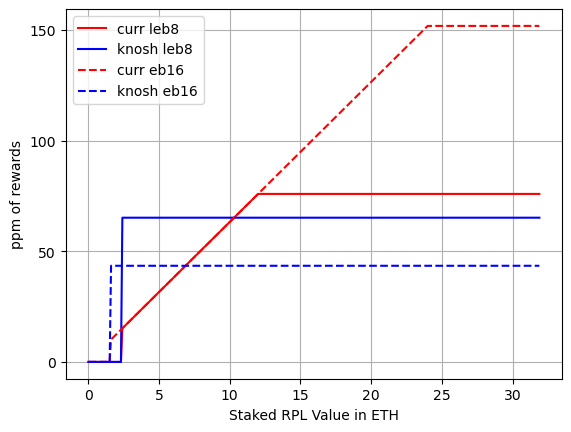
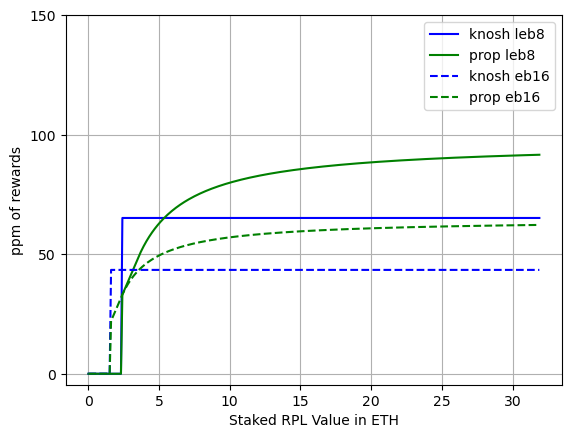
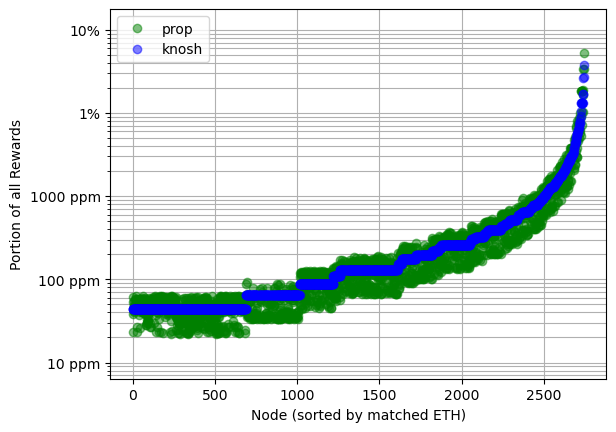
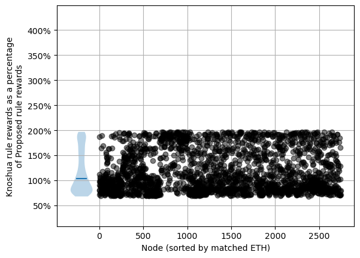

# [DRAFT] RPL Staking Analysis and Initial Suggestion
July 2023

## High level RPL-staking options

### [DRAFT] Visualized rule sets

### [DRAFT] Current rules

- "Minimum" RPL stake is 10% of borrowed ETH (aka protocol ETH, pETH, matched ETH)
  - You must be over this threshold _including_ a new minipool to launch a new minipool
  - You must be over this threshold at rewards snapshot time to be eligible for RPL rewards
- Maximum effective RPL stake is 150% of bonded ETH (aka NO ETH, nETH, provided ETH)
  - Up to this much RPL at rewards snapshot time can be eligible for RPL rewards
- The NO share of inflation gets split up per-effective-RPL

### [DRAFT] "Knoshua" rules
- "Minimum" RPL stake is 10% of borrowed ETH (aka protocol ETH, pETH, matched ETH)
  - You must be over this threshold _including_ a new minipool to launch a new minipool
  - You must be over this threshold at rewards snapshot time to be eligible for RPL rewards
- Only the minimum is "effective".
- If you're below 10% of borrowed ETH, you get no rewards
- The NO share of inflation gets split up per-effective-RPL

### [DRAFT] Proposed rules
- "Minimum" RPL stake is 10% of borrowed ETH (aka protocol ETH, pETH, matched ETH)
  - You must be over this threshold _including_ a new minipool to launch a new minipool
  - You must be over this threshold at rewards snapshot time to be eligible for RPL rewards
- Rewards are based on weight
  - If you're below 10% borrowed ETH, weight is 0
  - From 10%-15% borrowed ETH, weight is linear with the amount of borrowed ETH
  - Above 15%, weight follows a logarithmic curve, rising forever, but ever-more-slowly
- The NO share of inflation gets split up as weight/total_summed_weight

## The proposed plan
- Take up the "Proposed rules" above in order to:
  - Reward primarily based on borrowed ETH, as this is what allows RP to meet rETH demand
  - Discourage large-scale speculation while getting RPL yield from the protocol
    - Encourages speculative holdings either exposed to inflation, or active in defi
  - Keep active rebalancing for good performance minimal. Importantly, there should be essentially
    no downside to being slightly above the minimum (including opportunity cost)
  - The rules will apply to all validators including new ones and currently running ones.
- Move the minimum to withdraw to 15% borrowed ETH (the end of the linear region)
  - This minimizes how "locked" users are, while also acknowledging that RPL is highly volatile; we
    don't want to encourage users to end up below the "minimum" used to start a minipool
- Keep some kind of time lock around staking to avoid gaming reward snapshot times
  - There has been talk about tracking stake at all times instead of just at the snapshot time; I
    believe this would be extremely challenging in a post-oDAO world, and we should be designing
    with that in mind
  - The current lock (can't unstake for 28 days after staking) is functional, which is a fairly
    strong argument for keeping it as is
    - One fairly modest suggestion that's been floated is to make an exception for claimAndStake.
      The premise here is that there is little room for gaming with these amounts, and many folks
      might inadvertently lock their stake by doing this.
- Phase in the new rules slowly
  - For rewards, this can be achieved by calculating the "share of the pie" for both rule sets, and
    then adding them together in a changing proportion.
    - Period X after the vote: `0.17*x*proposed_share + 0.17*(6-x)*current_share`  
    - After period 5, simply used proposed_share
  - For the withdrawal threshold, it's a little complicated. First, it requires a pDAO guardian
    action, so we don't want to do a ton of changes. Second, the current setting is based off of
    bonded ETH, _not_ borrowed ETH. This means 16-ETH minipool holders will have a higher withdrawal
    threshold than intended. Still, it will be much lower than the current one (less than a third).
    - After Period X=3 rewards go out, set withdrawal threshold to 100% bonded ETH
    - After Period X=6 rewards go out, set withdrawal threshold to 45% bonded ETH
      - This is equivalent to the desired 15% borrowed ETH for LEB8s; unfortunately, it's 45%
        borrowed ETH for 16-ETH minipools, but that's the best we can do without a SC change
    - In the next planned Smart Contract release, update to be based on borrowed ETH
      - Once active, set withdrawal threshold to 15% borrowed ETH
- Don't impact voting -- keep that using 0.5*sqrt(min(rpl, 150%_bonded_eth_value_in_rpl))
  - Not taking a position on whether this should change, but if that's desired it can be an
    independent proposal

## A more detailed comparisons between rule sets

### [DRAFT] Current vs Knoshua
|      |      |
|:--------------------------------:|:-----------------------------------:|
|  |  |

- When providing the same amount of rETH supply (aka, at one point on the x axis), the current rules
  have a massive variation in RPL rewards of up to 15x based on the amount of RPL staked. Knoshua's
  rules have zero variation.
- Knoshua's plan _strongly_ favors people that are RPL-hesitant and want to join with low exposure.
  For folks at the minimum, they'd see their rewards ~4.3x
  - This also makes it easier to attract new NOs since the higher rewards can defray the up-front
    RPL price risk
- Knoshua's plan would see the median current NO get ~2x the rewards of the current plan
  - A fair number of NOs end up lower than current rewards.
- Knoshua's plan strongly favors LEB8s. This aligns RPL rewards to what helps the protocol (the
  ability to meet rETH demand).

### [TODO] Current vs Proposed
|      |      |
|:--------------------------------:|:-----------------------------------:|
|  |  |

- When providing the same amount of rETH supply (aka, at one point on the x axis), the current rules
  have a massive variation in RPL rewards of up to 15x based on the amount of RPL staked. For the
  proposed rules, that variation is down to ~3x (technically, the log gains continue indefinitely
  but with aggressively lowering marginal benefit; here I used 12 ETH worth of RPL staked on an LEB8
  as a realistic "limit")
- The proposed plan _strongly_ favors people that are RPL-hesitant and want to join with low
  exposure. For folks at the minimum, they'd see their rewards ~2.44x
  - This also makes it easier to attract new NOs since the higher rewards can defray the up-front
    RPL price risk
- The proposed plan would see the median current NO get over 2x the rewards of the current plan
  - Very few NOs would see a decrease in their rewards (only 16-ETH minipool holders with more than
    8.1 ETH of RPL staked per 16-ETH minipool)
- The proposed plan strongly favors LEB8s. This aligns RPL rewards to what helps the protocol (the
  ability to meet rETH demand).

### [TODO] Proposed vs Knoshua
|      |      |
|:--------------------------------:|:-----------------------------------:|
|  |  |

This is not the main comparison point, tbh, so I'll be quick:
- The biggest gains are smaller with the proposed plan
- The biggest losses are smaller with the proposed plan
- There are more "winners" with the proposed plan and current allocations

## Brass Tacks

### Expanded Rationale
This is touched on some in [the proposed plan](#the-proposed-plan) section, but it's worth giving a
bit more space. Funds should be used to achieve protocol goals - ie, they should be used to convince
people to do the things that benefit RP.

- We need the ability to meet rETH demand
  - We should scale rewards on pETH, which is directly related to meeting rETH demand.
    - This implies we'll favor LEB8s over EB16s because they more efficiently meet rETH demand.
- Having a lot of bonded RPL on a node is not better for the protocol than having near the minimum
  - RPL-as-collateral: any collateral use case _must_ work with the minimum, as attackers aren't
    likely to put up more than is needed (there's details about RPL's limitations here, but the main
    point is sufficient).
  - Some amount of RPL beyond the minimum is a convenience -- a buffer so the NO doesn't need to be
    highly active. We should keep that if possible, as the proposed plan aims to.
  - "Protected speculation" is a term I once used for the "benefit" of RPL rewards at high
    node collateral. Our system of inflation is opinionated and does _not_ reward speculation
    outside the protocol; I don't see a benefit to reward it within the protocol either, as it
    doesn't achieve protocol goals.

### RPL Value (a model combining appreciation and rewards)
Some people have mentioned fears of this proposal causing a sell-off from RPL-heavy folks.
I don't see this at all. 

We can model expected price appreciation against ETH as an APR. For example, if you expect price to
double within 2 years, you can get an apr of `2^(1/2) - 1 = 1.41 - 1 = 41%`. If you make that your
risk adjusted expectation (eg, you'll call it 1.8x to make up for high risk, even though you think
it has a 2x EV), you can include that too (in this case that would be 34%).

|  |                     |
|:-----------------------------------------:|:-----------------------------------------------------------------:|

These charts use the above per-year expectation as the x-axis.

The blue line is current "Net RPL" based on RPL rewards plus that expected appreciation. The orange
line is the node that loses the most by swapping to the proposed plan (only EB16s with exactly 24
ETH worth of RPL each).

The light gray line is how much APR those assets could get as ETH instead. The dark gray line is how
much ROI those assets could get as ETH instead _iff_ it activates the maximum amount of RPL.

To determine if someone who's currently holding should sell based off of the proposed plan:
- Choose a per-year expectation (essentially an amount of bullishness)
- Choose a reference, based on if selling to ETH would activate RPL (one of the two gray lines)
- At your per-year expectation, go up to the blue line
  - If it's below your reference, you should sell under the current plan
- At your per-year expectation, go up to the orange line
  - If it's below your reference AND the blue line was above your reference, the proposed plan may
    be a rational reason to sell

Based on that process, we see that the dark gray line is above orange but below blue in a very
narrow range -- from 1.03x to 1.08x per-year ratio expectation.

❗❗This means that anyone expecting more than 8% yearly appreciation should not
be moved to sell because of this plan change.

RPL-heavy folks tend to be RPL-bullish. I expect very few (if any) RPL heavy people have
expectations below 1.08x per-year on the ratio. Note also that if there's some initial selling
depressing RPL price, which drives price down a bit, then the remaining holders may actually have
higher per-year expectations as the price dropped, but the holder's "perceived fair value" may be
unsupervised.

It's worth noting this is just a model - the map is not the territory. It's likely some folks are
spooked by change, and perhaps by "number go down" on the rewards front. Nonetheless, I don't see
any reason to expect a large-scale sell-off.

### [DRAFT] Why change? People entered with this ruleset.

I believe consistency is important. We shouldn't change things just because we can. That said, I
also don't believe we should totally shackle ourselves forever based on past decisions.

Let's start with another question -- where does the current ruleset come from?
- The minimum
  - Initial design by fireeyes -- no insight into reasoning
  - Often used in RPL price models to set the fundamental floor value of RPL 
  - When we added LEB8s, we wanted to keep the fundamental floor value in those models unchanged,
    which is why we went with keeping it constant as a percent of borrowed ETH
- The maximum
  - Initial design by fireeyes -- no insight into reasoning [?? IS THIS RIGHT?]
  - There was a rather stressful vote when adding LEB8s about whether the maximum should be 150% of
    borrowed ETH, 150% of bonded ETH, or flat per minipool
  - During that vote, there were attempts to justify the original 150% number for 16-ETH (so that 
    we could better understand what it meant to minimize change). The best reason I saw was that it
    served as "protected speculation" for heavily RPL-aligned individuals.
  - There was an interaction with the minimum threshold to withdraw until Redstone. It was possible
    to instantly stake RPL and have that affect rewards, so if people could withdraw at will, they
    could get all the benefits of max stake while only having the RPL staked for a moment. [?? IS 
    THIS RIGHT? DID WE HAVE THE TIMELOCK BEFORE REDSTONE?]
- Keeping the rules the same
  - All else being equal, stability is good
  - Right now we're rewarding speculating within the protocol, rather than creating rETH supply
    - This is _not_ aligned with the protocol's needs, which is a suitably important reason to make
      changes.
  - Now that we're post-Shapella, people can exit if the rules truly don't suit them. This makes it
    less critical to keep things exactly the same